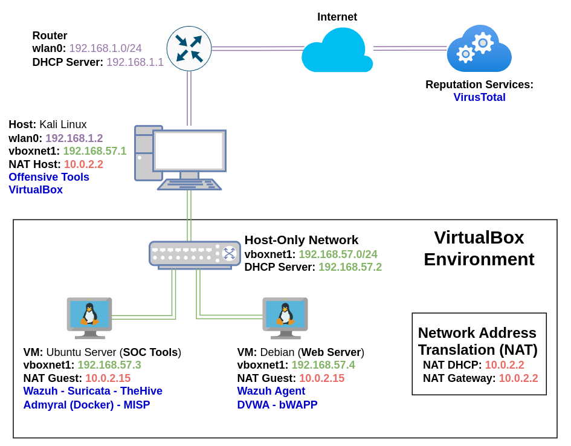
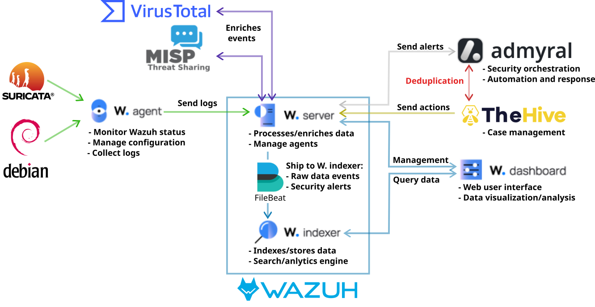

# Just Another Homelab (JAH) - Web Server Monitoring

This homelab provides a virtual environment to practice with tools commonly used by Security Operations Center (SOC) teams to monitor, detect, manage, and investigate security incidents. The lab is specifically designed to monitor a Debian web server that is running vulnerable web servers. It utilizes security tools that are self-hosted on an Ubuntu Server to detect malicious activities that may be carried out using offensive tools in Kali Linux.

## Outline

1. [Diagrams](#diagram)
2. [Installation](#installation)

## Diagrams

The diagram below illustrates Kali Linux as the host machine hosting the virtual environment created with VirtualBox. This virtual environment includes an Ubuntu Server virtual machine equipped with security tools and a Debian virtual machine running the vulnerable web servers. The security tools will utilize APIs to communicate with external services such as VirusTotal and MISP. For those who prefer to use a different host machine such as Windows, instructions will be provided for running Kali Linux as a virtual machine.

The diagram below decipts the secuty solution that will be employed.

## Installation

For those who are particularly interested in cyber security analysis, you can download the VirtualBox `.OVA` files of the Ubuntu Server virtual machine containing the SOC tools and the Debian virtual machine with the vulnerable web servers pre-installed by clicking on the link provided below:

- [Download VirtualBox .OVA files](#)

For individuals interested in cyber security engineering, the following steps are provided for setting up the complete lab:

- Set up the virtual infrastructure in VirtualBox:
	- [Virtual Machines installation and configuration step-by-step.](./docs/jahws_vms.md)
- Install and configure the security tools on the Ubuntu Server virtual machine.
	- [Tools installation and configuration step-by-step.](./docs/jahws_tools.md)
- Install and configure the vulnerable web servers on the Debian virtual machine.
	- [Web servers installation and configuration step-by-step](#)

